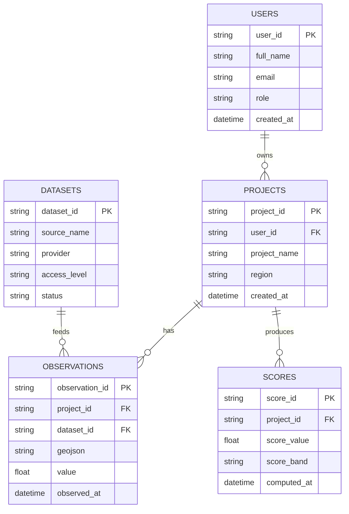

# Entity Relationship Diagram (ERD)

```mermaid
erDiagram
    USERS ||--o{ PROJECTS : owns
    PROJECTS ||--o{ OBSERVATIONS : has
    PROJECTS ||--o{ SCORES : produces
    DATASETS ||--o{ OBSERVATIONS : feeds

    USERS {
        string user_id PK
        string full_name
        string email
        string role
        datetime created_at
    }

    PROJECTS {
        string project_id PK
        string user_id FK
        string project_name
        string region
        datetime created_at
    }

    DATASETS {
        string dataset_id PK
        string source_name
        string provider
        string access_level
        string status
    }

    OBSERVATIONS {
        string observation_id PK
        string project_id FK
        string dataset_id FK
        string geojson
        float value
        datetime observed_at
    }

    SCORES {
        string score_id PK
        string project_id FK
        float score_value
        string score_band
        datetime computed_at
    }
```

## Notes

- `DATASETS.status` tracks whether the source is `blocked`, `verified`, or `active`.
- CSV export is only allowed once dataset access is verified.
