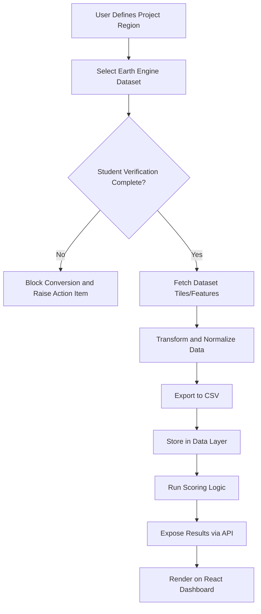

# TerraScore System Flow

```mermaid
flowchart TD
    A[User Defines Project Region] --> B[Select Earth Engine Dataset]
    B --> C{Student Verification Complete?}
    C -- No --> D[Block Conversion and Raise Action Item]
    C -- Yes --> E[Fetch Dataset Tiles/Features]
    E --> F[Transform and Normalize Data]
    F --> G[Export to CSV]
    G --> H[Store in Data Layer]
    H --> I[Run Scoring Logic]
    I --> J[Expose Results via API]
    J --> K[Render on React Dashboard]
```

## Blocker Gate

- The verification gate is mandatory before data can be exported to CSV.
